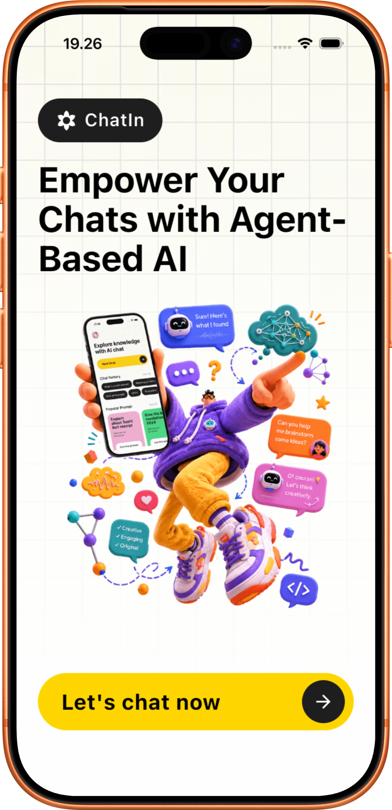
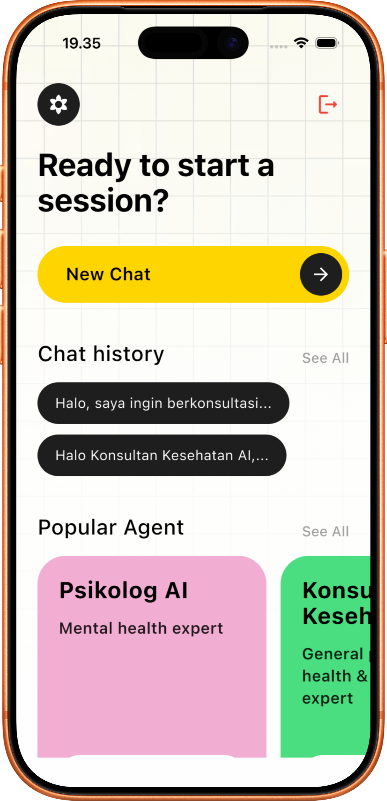
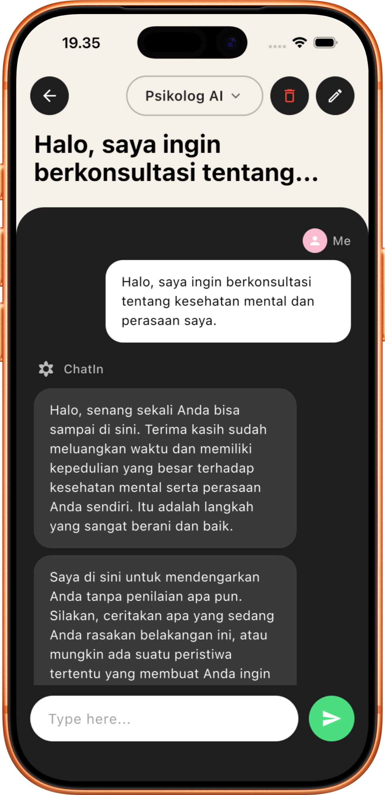

<p align="center">
  
</p>

<h1 align="center">ChatIn</h1>

<p align="center">
  <strong>The best AI chatbot in the world with a fun concept ✨</strong>
</p>

<p align="center">
  
  
  
  
</p>

<p align="center">
  
  
  
</p>

---

## 📱 Screenshots

<p align="center">
  
  &nbsp;&nbsp;&nbsp;&nbsp;
  
  &nbsp;&nbsp;&nbsp;&nbsp;
  
</p>

<p align="center">
  <em>Landing Page • Dashboard & Agent Selection • AI Chat Conversation</em>
</p>

---

## 🌟 About

**ChatIn** adalah aplikasi mobile berbasis AI yang menyediakan ekosistem **"Ruang Obrolan Spesialis"** — di mana setiap ruang dihuni oleh agen AI dengan persona, keahlian, dan instruksi unik. Pengguna dapat berinteraksi dengan AI layaknya berkonsultasi dengan seorang spesialis:

- 🧠 **Psikolog AI** — Konselor kesehatan mental yang empatik dan tidak menghakimi
- 🎨 **Mentor UI/UX** — Pakar desain untuk membantu memahami prinsip-prinsip desain produk
- 💻 **Asisten Koding** — AI generalist untuk debugging dan tanya jawab pemrograman

Setiap agen memiliki konteks obrolan yang **terisolasi** — percakapan dengan Psikolog AI tidak akan pernah tercampur dengan sesi Mentor UI/UX.

---

## 🏗️ Architecture

```text
┌──────────────────────┐     ┌──────────────────────────────────────────┐
│                      │     │           Supabase (BaaS)                │
│   Flutter App        │◄───►│  ┌─────────-┐ ┌──────-──┐ ┌───────────┐  │
│   (Android & iOS)    │     │  │  Auth    │ │ Postgres│ │ pgvector  │  │
│                      │     │  │(Google,  │ │   DB    │ │ (RAG)     │  │
└───────┬──────────────┘     │  │ Email)   │ └──────-──┘ └───────────┘  │
        │                    └──────────┬───────────────────────────────┘
        │ (Chat API)                    │
        ▼                               │
┌──────────────────────┐                │
│   Next.js Dashboard  │◄───────────────┘
│   (Admin Panel)      │◄──────────────────► Sumopod API (LLM & Embedding)
│   • Agent Management │
│   • Knowledge Base   │
│   • RAG Pipeline     │
└──────────────────────┘
```

---

## ⚡ Tech Stack

| Layer               | Technology          | Purpose                                         |
| ------------------- | ------------------- | ----------------------------------------------- |
| **Mobile**          | Flutter (Dart)      | Cross-platform native UI for Android & iOS      |
| **Admin Dashboard** | Next.js 16          | Agent management, RAG pipeline, chat playground |
| **Backend & Auth**  | Supabase            | PostgreSQL + Auth + RLS + Realtime              |
| **Vector Database** | pgvector (Supabase) | Semantic search for RAG knowledge base          |
| **AI / LLM**        | Sumopod API         | Chat completions & text embeddings              |
| **Local Storage**   | SQLite (sqflite)    | Offline chat history on device                  |

---

## 📂 Project Structure

```
ChatIn/
├── chatin/                    # 📱 Flutter Mobile App
│   ├── lib/
│   │   ├── main.dart              # App entry point & auth routing
│   │   ├── providers/             # State management (ChangeNotifier)
│   │   │   └── auth_provider.dart     # Auth logic (Email, Google Sign-In)
│   │   ├── screens/               # UI Screens
│   │   │   ├── home_screen.dart       # Landing page
│   │   │   ├── login_screen.dart      # Login with social auth
│   │   │   ├── register_screen.dart   # Registration
│   │   │   ├── dashboard_screen.dart  # Agent selection & chat history
│   │   │   └── chat_screen.dart       # Real-time AI conversation
│   │   ├── services/              # Business logic layer
│   │   │   ├── chat_service.dart      # HTTP calls to Next.js API
│   │   │   └── database_helper.dart   # SQLite local persistence
│   │   └── widgets/               # Reusable UI components
│   ├── ios/                   # iOS native configuration
│   └── android/               # Android native configuration
│
├── chatin-dashboard/          # 🖥️ Next.js Admin Dashboard
│   └── src/
│       ├── app/
│       │   ├── api/chat/          # Chat API endpoint (secured with API Key)
│       │   └── (dashboard)/       # Admin pages (agents, knowledge-base, chat)
│       ├── services/              # Supabase service layer
│       └── utils/                 # AI (Sumopod) & Supabase clients
│
├── docs/                      # 📄 Project documentation
│   ├── PRD_Chatln.md              # Product Requirements Document
│   └── Tech_Concept_Brief.md     # Technical architecture overview
│
└── assets/screenshots/        # 🖼️ App screenshots
```

---

## 🔑 Key Features

### Mobile App (Flutter)

- ✅ **Multi-Agent Chat** — Choose from specialized AI agents with unique personas
- ✅ **Google Sign-In** — Native authentication via `google_sign_in` v7.x
- ✅ **Chat History** — Persistent conversations stored locally with SQLite
- ✅ **Delete Chat Sessions** — Full control over your conversation data
- ✅ **Simulated Streaming** — Word-by-word AI response rendering
- ✅ **Beautiful UI** — Clean, modern interface with custom widgets

### Admin Dashboard (Next.js)

- ✅ **Agent Management** — Create, edit, and configure AI agents with custom system prompts
- ✅ **Knowledge Base (RAG)** — Upload documents, automatic chunking & vector embedding
- ✅ **Chat Playground** — Test agents directly from the dashboard
- ✅ **API Key Security** — Protected endpoints with `x-api-key` header validation
- ✅ **Dual Auth** — Supports both API Key (external) and Session (dashboard) authentication

---

## 🚀 Getting Started

### Prerequisites

- Flutter SDK `>= 3.x`
- Node.js `>= 18`
- Supabase project with `pgvector` extension enabled
- Sumopod API key
- Google Cloud Console project (for Google Sign-In)

### 1. Clone the Repository

```bash
git clone https://github.com/Fnrzz/ChatIn.git
cd ChatIn
```

### 2. Setup Flutter App

```bash
cd chatin

# Create .env file
cat > .env << EOF
SUPABASE_URL=your_supabase_url
SUPABASE_ANON_KEY=your_supabase_anon_key
NEXT_API_URL=http://localhost:3000/api/chat
API_SECRET_KEY=your_secret_key
EOF

# Install dependencies
flutter pub get

# Run on device/simulator
flutter run
```

### 3. Setup Next.js Dashboard

```bash
cd chatin-dashboard

# Create .env.local file
cat > .env.local << EOF
NEXT_PUBLIC_SUPABASE_URL=your_supabase_url
NEXT_PUBLIC_SUPABASE_ANON_KEY=your_supabase_anon_key
SUPABASE_SERVICE_ROLE_KEY=your_service_role_key
SUMOPOD_API_KEY=your_sumopod_api_key
SUMOPOD_CHAT_MODEL=gpt-3.5-turbo
API_SECRET_KEY=your_secret_key
EOF

# Install dependencies
npm install

# Run development server
npm run dev
```

---

## 🔒 Security

| Feature                   | Implementation                                             |
| ------------------------- | ---------------------------------------------------------- |
| **API Protection**        | Custom `x-api-key` header validation on all chat endpoints |
| **Row Level Security**    | Supabase RLS policies ensure data isolation per user       |
| **Session Management**    | Encrypted auth tokens managed by Supabase Auth             |
| **Environment Variables** | All secrets stored in `.env` files (excluded from Git)     |
| **Dual Authentication**   | API Key for external clients + Session auth for dashboard  |

---

## 🗺️ Roadmap

- [x] Phase 0 — Project setup, Supabase config, Sumopod integration
- [x] Phase 1 (MVP) — Auth, multi-agent chat, local history, RAG pipeline
- [ ] Phase 2 — Subscription system, premium agents, Google Play Billing & Apple IAP
- [ ] Phase 3 — Push notifications, analytics, UI polish, store submission

---

## 👨‍💻 Author

**Farid Nur Raidananda** — [@Fnrzz](https://github.com/Fnrzz)

---

<p align="center">
  Made with ❤️ using Flutter, Next.js & Supabase
</p>
