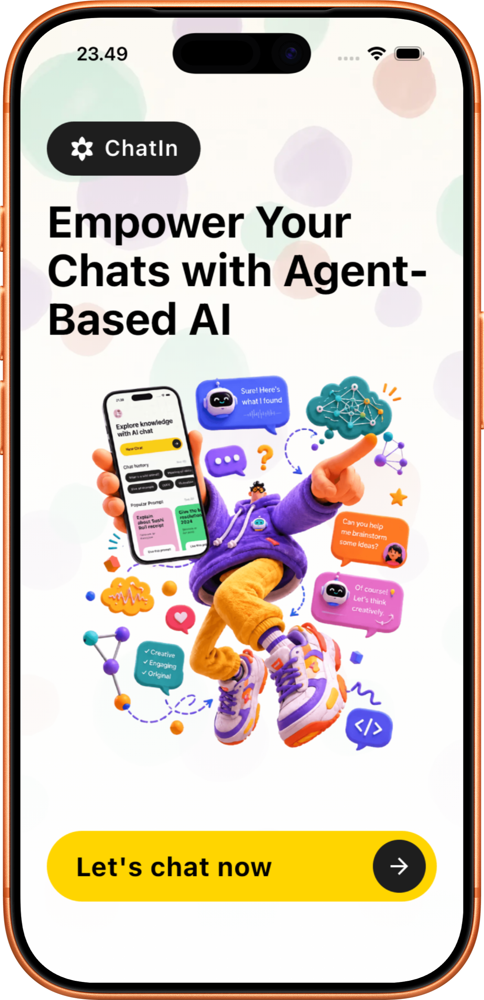

<p align="center">
  
</p>

<h1 align="center">ChatIn</h1>

<p align="center">
  <strong>The best AI chatbot in the world with a fun concept ✨</strong>
</p>

<p align="center">
  
  
  
  
  
</p>

<p align="center">
  
  
  
</p>

---

## 📱 Screenshots

<p align="center">
  
  &nbsp;&nbsp;&nbsp;&nbsp;
  
  &nbsp;&nbsp;&nbsp;&nbsp;
  
</p>

<p align="center">
  <em>Home Page • Dashboard & Agent Selection • AI Chat Conversation</em>
</p>

---

## 🌟 About

**ChatIn** adalah aplikasi mobile berbasis AI yang menyediakan ekosistem **"Ruang Obrolan Spesialis"** — di mana setiap ruang dihuni oleh agen AI dengan persona, keahlian, dan instruksi unik. Pengguna dapat berinteraksi dengan AI layaknya berkonsultasi dengan seorang spesialis:

- 🧠 **Psikolog AI** — Konselor kesehatan mental yang empatik dan tidak menghakimi
- 🎨 **Mentor UI/UX** — Pakar desain untuk membantu memahami prinsip-prinsip desain produk
- 💻 **Asisten Koding** — AI generalist untuk debugging dan tanya jawab pemrograman

Setiap agen memiliki konteks obrolan yang **terisolasi** — percakapan dengan Psikolog AI tidak akan pernah tercampur dengan sesi Mentor UI/UX.

---

## 🏗️ Architecture

```text
┌──────────────────────┐     ┌──────────────────────────────────────────┐
│                      │     │           Supabase (BaaS)                │
│   Flutter App        │◄───►│  ┌──────────┐ ┌────────┐ ┌───────────┐  │
│   (Android & iOS)    │     │  │  Auth     │ │Postgres│ │ pgvector  │  │
│                      │     │  │(Google,   │ │   DB   │ │ (RAG)     │  │
└───────┬──────────────┘     │  │ Email)    │ └────────┘ └───────────┘  │
        │                    └──────────┬───────────────────────────────┘
        │ (Chat API)                    │
        ▼                               │
┌──────────────────────┐                │
│   Next.js Dashboard  │◄───────────────┘
│   (Admin Panel)      │◄──────────────────► Sumopod API (LLM & Embedding)
│   • Agent Management │
│   • Knowledge Base   │
│   • RAG Pipeline     │
│   • Chat Playground  │
└──────────────────────┘

┌──────────────────────┐
│  Next.js Landing     │  ← Public-facing marketing site
│  Page (chatin-       │
│  landingpage)        │
└──────────────────────┘
```

---

## ⚡ Tech Stack

| Layer                | Technology              | Purpose                                            |
| -------------------- | ----------------------- | -------------------------------------------------- |
| **Mobile**           | Flutter 3.x (Dart ^3.12)| Cross-platform native UI for Android & iOS         |
| **Admin Dashboard**  | Next.js 16 + Tailwind 4 | Agent management, RAG pipeline, chat playground    |
| **Landing Page**     | Next.js 16 + Tailwind 4 | Public-facing marketing & download page            |
| **Backend & Auth**   | Supabase                | PostgreSQL + Auth + RLS + Realtime                 |
| **Vector Database**  | pgvector (Supabase)     | Semantic search for RAG knowledge base             |
| **AI / LLM**        | Sumopod API             | Chat completions & text embeddings                 |
| **UI Components**    | shadcn/ui + Radix UI    | Dashboard component library                       |
| **Local Storage**    | SharedPreferences       | Theme preference & settings on device              |
| **Encryption**       | encrypt (AES-256)       | Client-side chat content encryption                |
| **Localization**     | easy_localization       | Multi-language support (EN, ID)                    |

---

## 📂 Project Structure

```
ChatIn/
├── chatin/                        # 📱 Flutter Mobile App
│   ├── lib/
│   │   ├── main.dart                  # App entry point & auth routing
│   │   ├── models/
│   │   │   └── chat_message.dart      # Chat message data model
│   │   ├── providers/                 # State management (ChangeNotifier)
│   │   │   ├── auth_provider.dart     # Auth logic (Email, Google Sign-In)
│   │   │   └── theme_provider.dart    # Dark/Light/System theme switching
│   │   ├── screens/                   # UI Screens
│   │   │   ├── home_screen.dart       # Landing/welcome page
│   │   │   ├── login_screen.dart      # Login with social auth
│   │   │   ├── register_screen.dart   # Registration
│   │   │   ├── otp_verification_screen.dart  # OTP email verification
│   │   │   ├── dashboard_screen.dart  # Main hub: agent selection & chat history
│   │   │   ├── agents_screen.dart     # Browse available AI agents
│   │   │   ├── chat_screen.dart       # Real-time AI conversation
│   │   │   ├── history_screen.dart    # Chat session history
│   │   │   └── profile_screen.dart    # User profile & settings
│   │   ├── services/                  # Business logic layer
│   │   │   └── chat_service.dart      # HTTP calls to Next.js Chat API
│   │   ├── utils/
│   │   │   └── encryption_helper.dart # AES-256 encryption for chat content
│   │   └── widgets/                   # Reusable UI components
│   │       ├── agent_card.dart        # Agent display card
│   │       ├── agent_selector.dart    # Agent selection bottom sheet
│   │       ├── chat_bubble.dart       # Chat message bubble
│   │       ├── chat_input_bar.dart    # Message input field
│   │       ├── history_chip.dart      # Chat history chip
│   │       ├── screen_background.dart # Gradient background wrapper
│   │       ├── section_header.dart    # Section title header
│   │       ├── social_button.dart     # Social auth button
│   │       └── typing_indicator.dart  # AI typing animation
│   ├── assets/
│   │   ├── images/                # App images
│   │   └── translations/         # Localization files (en.json, id.json)
│   ├── ios/                       # iOS native configuration
│   └── android/                   # Android native configuration
│
├── chatin-dashboard/              # 🖥️ Next.js Admin Dashboard
│   └── src/
│       ├── app/
│       │   ├── (auth)/
│       │   │   └── login/             # Admin login page
│       │   ├── (dashboard)/
│       │   │   ├── layout.tsx         # Dashboard shell with sidebar
│       │   │   ├── agents/            # Agent CRUD management
│       │   │   ├── avatars/           # Agent avatar management
│       │   │   ├── chat/              # Chat playground for testing agents
│       │   │   └── knowledge-base/    # RAG document upload & management
│       │   ├── actions/
│       │   │   └── rag.actions.ts     # Server actions for RAG processing
│       │   └── api/chat/
│       │       ├── route.ts           # Main chat API (streaming + RAG)
│       │       ├── generate-title/    # Auto-generate chat session title
│       │       └── summarize/         # Conversation summarization
│       ├── components/
│       │   ├── layout/                # Sidebar navigation components
│       │   └── ui/                    # shadcn/ui components (14 components)
│       ├── services/                  # Supabase service layer
│       │   ├── agent.service.ts       # Agent CRUD operations
│       │   ├── knowledge.service.ts   # Knowledge base operations
│       │   └── user.service.ts        # User management
│       ├── types/                     # TypeScript type definitions
│       │   ├── agent.ts               # Agent type
│       │   ├── knowledge.ts           # Knowledge base types
│       │   ├── navigation.ts          # Navigation config types
│       │   └── user.ts                # User type
│       ├── utils/
│       │   ├── ai/sumopod.ts          # Sumopod API client + embeddings
│       │   └── supabase/              # Supabase client (server + client)
│       └── proxy.ts                   # API proxy configuration
│
├── chatin-landingpage/            # 🌐 Next.js Landing Page
│   └── src/
│       ├── app/
│       │   ├── layout.tsx             # Root layout with Geist fonts
│       │   ├── page.tsx               # Landing page entry
│       │   └── globals.css            # Global styles
│       └── components/
│           ├── Navbar.tsx             # Navigation bar with branding
│           └── Hero.tsx               # Hero section with CTA & mockup
│
├── docs/                          # 📄 Project documentation
│   ├── PRD_Chatln.md                  # Product Requirements Document
│   └── Tech_Concept_Brief.md         # Technical architecture overview
│
└── assets/screenshots/            # 🖼️ App screenshots
    ├── homepage.png
    ├── homepage-new.png
    ├── dashboardpage.png
    └── chatroom.png
```

---

## 🔑 Key Features

### Mobile App (Flutter)

- ✅ **Multi-Agent Chat** — Choose from specialized AI agents with unique personas
- ✅ **Google Sign-In** — Native authentication via `google_sign_in` v7.x
- ✅ **Email OTP Verification** — Secure email verification with OTP flow
- ✅ **Chat History** — Persistent conversations with session management
- ✅ **Streaming Response** — Real-time word-by-word AI response rendering
- ✅ **Dark/Light Mode** — System-aware theme switching with persistence
- ✅ **Multi-Language** — Localization support (English & Bahasa Indonesia)
- ✅ **Chat Encryption** — AES-256 encryption for chat content security
- ✅ **Agent Browser** — Browse and select from available specialist agents
- ✅ **User Profile** — Profile management and app settings
- ✅ **Beautiful UI** — Clean, modern interface with custom widgets & animations

### Admin Dashboard (Next.js)

- ✅ **Agent Management** — Create, edit, and configure AI agents with custom system prompts
- ✅ **Agent Avatars** — Upload and manage agent avatar images
- ✅ **Knowledge Base (RAG)** — Upload documents, automatic chunking & vector embedding
- ✅ **Chat Playground** — Test agents directly from the dashboard
- ✅ **Auto Title Generation** — AI-powered chat session title generation
- ✅ **Conversation Summarization** — Automatic conversation context summarization
- ✅ **API Key Security** — Protected endpoints with `x-api-key` header validation
- ✅ **Dual Auth** — Supports both API Key (external) and Session (dashboard) authentication
- ✅ **Sidebar Navigation** — Clean admin layout with sidebar and user footer

### Landing Page (Next.js)

- ✅ **Hero Section** — Eye-catching hero with app mockup and CTA buttons
- ✅ **App Store Badges** — Download links for App Store & Google Play
- ✅ **Responsive Design** — Mobile-first responsive layout
- ✅ **Glassmorphism UI** — Modern backdrop blur effects and glass-style components

---

## 🚀 Getting Started

### Prerequisites

- Flutter SDK `>= 3.x` (Dart `>= 3.12`)
- Node.js `>= 18`
- Supabase project with `pgvector` extension enabled
- Sumopod API key
- Google Cloud Console project (for Google Sign-In)

### 1. Clone the Repository

```bash
git clone https://github.com/Fnrzz/ChatIn.git
cd ChatIn
```

### 2. Setup Flutter App

```bash
cd chatin

# Create .env file
cat > .env << EOF
SUPABASE_URL=your_supabase_url
SUPABASE_ANON_KEY=your_supabase_anon_key
NEXT_API_URL=http://localhost:3000/api/chat
API_SECRET_KEY=your_secret_key
ENCRYPTION_KEY=your_32_char_encryption_key
EOF

# Install dependencies
flutter pub get

# Run on device/simulator
flutter run
```

### 3. Setup Next.js Dashboard

```bash
cd chatin-dashboard

# Create .env.local file
cat > .env.local << EOF
NEXT_PUBLIC_SUPABASE_URL=your_supabase_url
NEXT_PUBLIC_SUPABASE_ANON_KEY=your_supabase_anon_key
SUPABASE_SERVICE_ROLE_KEY=your_service_role_key
SUMOPOD_API_KEY=your_sumopod_api_key
SUMOPOD_CHAT_MODEL=gpt-3.5-turbo
API_SECRET_KEY=your_secret_key
EOF

# Install dependencies
npm install

# Run development server
npm run dev
```

### 4. Setup Landing Page

```bash
cd chatin-landingpage

# Install dependencies
npm install

# Run development server (default port: 3001)
npm run dev
```

---

## 🔒 Security

| Feature                   | Implementation                                             |
| ------------------------- | ---------------------------------------------------------- |
| **API Protection**        | Custom `x-api-key` header validation on all chat endpoints |
| **Row Level Security**    | Supabase RLS policies ensure data isolation per user       |
| **Session Management**    | Encrypted auth tokens managed by Supabase Auth             |
| **Chat Encryption**       | AES-256 encryption for chat content (client-side)          |
| **Environment Variables** | All secrets stored in `.env` files (excluded from Git)     |
| **Dual Authentication**   | API Key for external clients + Session auth for dashboard  |
| **API Proxy**             | LLM API keys never exposed to client; routed via Next.js   |

---

## 🗺️ Roadmap

- [x] Phase 0 — Project setup, Supabase config, Sumopod integration
- [x] Phase 1 (MVP) — Auth, multi-agent chat, local history, RAG pipeline
- [x] Phase 1.5 — Landing page, theme system, localization, encryption
- [ ] Phase 2 — Subscription system, premium agents, Google Play Billing & Apple IAP
- [ ] Phase 3 — Push notifications, analytics, UI polish, store submission

---

## 👨‍💻 Author

**Farid Nur Raidananda** — [@Fnrzz](https://github.com/Fnrzz)

---

<p align="center">
  Made with ❤️ using Flutter, Next.js & Supabase
</p>
